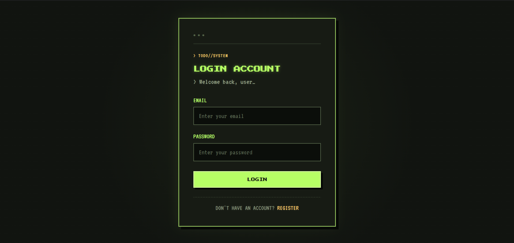
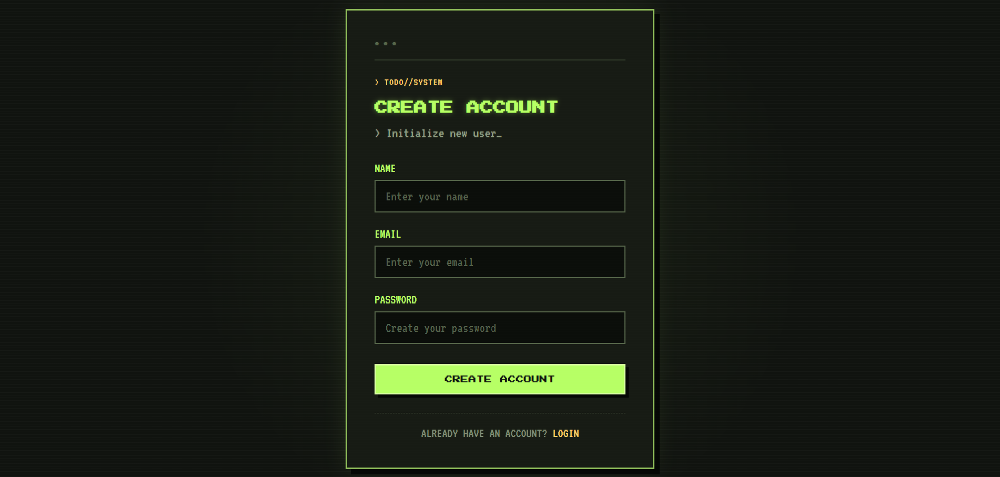
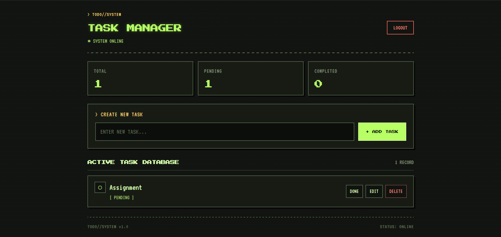

# Todo-Dashboard

A full-stack Todo-Dashboard application that allows users to create, manage, update, and delete their tasks.

##  Live Demo

[Open Todo-Dashboard](https://todo-dashboard-1.onrender.com)

##  Features

- User registration and login
- Secure authentication using JWT
- Create new tasks
- View personal tasks
- Update tasks
- Mark tasks as completed
- Delete tasks
- Responsive retro-style user interface
- Persistent task storage using MongoDB

## Screenshots

### Login


### Register


### Dashboard


##  Tech Stack

### Frontend
- React.js
- Vite
- Axios
- React Router
- CSS

### Backend
- Node.js
- Express.js
- MongoDB
- Mongoose
- JWT Authentication

### Deployment
- Frontend: Render
- Backend: Render
- Database: MongoDB Atlas

##  Project Structure

```text
Todo-Dashboard/
│
├── Backend/
│   ├── controller/
│   ├── middleware/
│   ├── models/
│   ├── routes/
│   ├── index.js
│   └── package.json
│
├── Frontend/
│   ├── src/
│   │   ├── component/
│   │   ├── App.jsx
│   │   └── main.jsx
│   ├── package.json
│   └── vite.config.js
│
└── README.md
```

## How It Works

1. Users register for an account.
2. Users log in and receive a JWT token.
3. The JWT token is stored in the browser's local storage.
4. Authenticated requests send the token to the backend API.
5. Todos are stored in MongoDB and linked to the logged-in user.
6. Users can create, view, update, complete, and delete their own tasks.

## Author

**Rishab Talukdar**

BCA Student | Full-Stack Web Development

